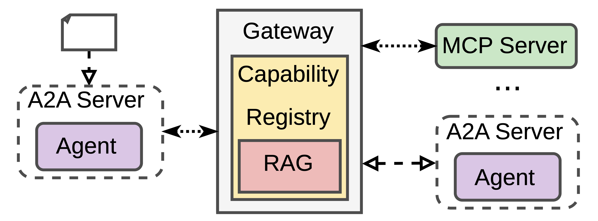
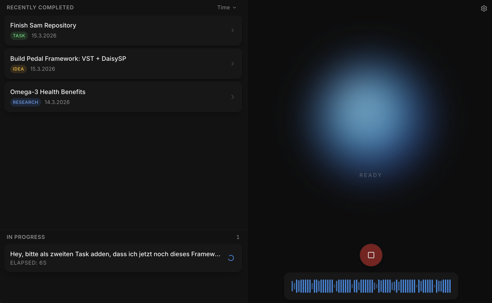
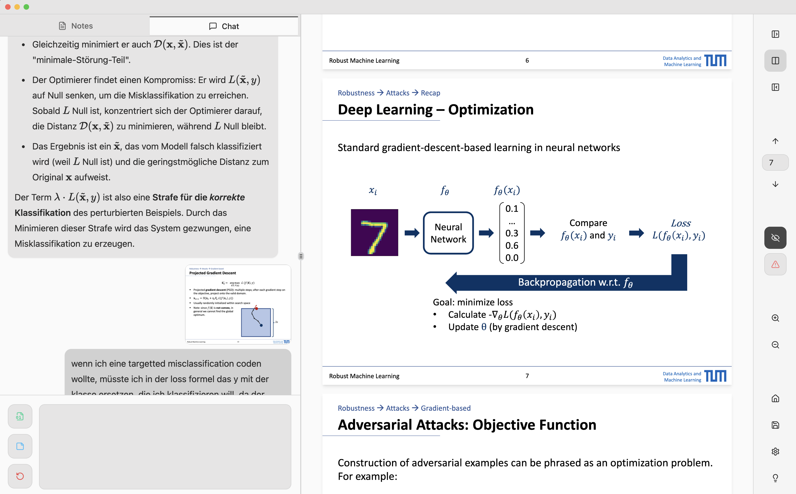

  

## &nbsp;***About me***

Computer Science Master’s student at TUM, building projects across **Agentic AI, ML, systems, and music tech**.

I like clean abstractions, practical tools, and ideas that are a bit nerdy but genuinely useful.  
On here, I mainly showcase projects around **multi-agent systems**, **audio / DSP**, and **personal AI tooling**.

## Featured Projects 🚀

### 🧠 [Capability Gateways for Multi-Agent Systems](https://github.com/maximilian-armuss-dev/capability-gateway)
My flagship research project on **multi-agent systems**.

This repo explores how to reduce **context bloat** and improve **staged information exposure** for agents.  
The core idea is a **Capability Gateway** that hides static tool/protocol complexity from the agent, so the agent can focus more on reasoning:
It handles **MCP, A2A, and RAG**, while caller agents are only exposed to 3 deliberately thin MCP tools.

**Includes**
- research code
- evaluation setup
- poster + paper
- architecture work around agent/tool abstraction

---

### 🎼 [Melformer](https://github.com/maximilian-armuss-dev/melformer)
An experimental music generation project built around **VQ-VAE + Transformer** ideas.

The main twist was a custom audio format I designed myself: instead of storing audio in the usual time-based way, it stores a fixed number of samples **per beat**.  
The idea was to represent rhythmic structure more naturally for sequence models.

I also explored using **complex-valued representations** to incorporate both **amplitude and phase information** more meaningfully across the pipeline.

Maybe *slightly* ambitious, but exactly the kind of ML idea I enjoyed exploring.

---

### 🎛️ [Prologue-FX](https://github.com/maximilian-armuss-dev/prologue-fx)
A framework built on top of the **KORG logue SDK** to make custom effect development for my **KORG Prologue 8** much cleaner.

Instead of writing the same boilerplate again and again, this project organizes the surrounding structure so I can focus on the actual **DSP logic**.

---

## Currently Building 🛠️

### 🎙️ SAM
A conversational voice assistant inspired by the AI companion SAM from *Mass Effect: Andromeda*.

The goal is a best-of-both-worlds setup:
**natural voice interaction on top, intelligent reasoning underneath.**

The conversation layer uses `gpt-1.5-realtime`, OpenAI's latest speech-to-speech model.
Under the hood, a deeper agentic system then does the following things:
1. classify transcripts
2. extracts tasks / ideas / research items
3. triggers follow-up actions (like performing in-depth research)
4. stores results so they can be revisited later through the voice interface again

---

### 📚 Clarif-AI
A personal AI-supported learning tool I use a lot myself.

Essentially, it's a study tool combining features I was missing in other tools:
- Smart PDF viewer: Allows hiding pages, as well as marking important ones
- Markdown editor with LaTeX integration
- Gemini as a tutor: Introduces you to the PDF's content, explains specific pages, can (optionally) read your notes on the topic

I’m currently **not showcasing the code publicly** because I want to improve the implementation further before presenting it as portfolio code.
Here's a screenshot of me using it tho.

---

### 🤖 [telegram2notion](https://github.com/maximilian-armuss-dev/telegram2notion)
A personal AI workflow project that turns thoughts into structured knowledge.

Using **Telegram, speech transcription, LLM analysis, and Notion**, this system converts voice notes and text messages into organized entries like ideas, todos, and notes.

This is a good example of stuff I like to build:
**Actually useful in daily life.**
